### Hi there 👋, I'm Lento.

- 🔭 I’m currently working on PIV & machine learning.
- ✨ Fun fact: I'm quite interested in fluid dynamics, specifically HPC CFD methods.
- 🦊 About me: I'm an aerospace engineer 🚀, currently at Empa, Switzerland.

<a href="https://metrics.lecoq.io/about/lento234"></img></a>
<a href="https://metrics.lecoq.io/about/lento234"></img></a>

<pre>
<strong><a href="https://manickathan.ch">Website</a> | <a href="https://twitter.com/MrLento234">Twitter</a> | <a href="https://github.com/lento234">GitHub</a> | <a href="https://www.linkedin.com/in/lento-manickathan/">LinkedIn</a> | <a href="https://hub.docker.com/u/mrlento234">Docker Hub</a> | <a href="https://scholar.google.ch/citations?user=wS-b8RcAAAAJ">Google Scholar</a></strong></pre>

