### <samp>**> Hi, I'm [Lento](https://manickathan.ch) 👋**</samp>

<pre>
<strong><a href="https://manickathan.ch">Homepage</a> | <a href="https://twitter.com/lento234">Twitter</a> | <a href="https://github.com/lento234">GitHub</a> | <a href="https://www.linkedin.com/in/lento-manickathan/">LinkedIn</a> | <a href="https://hub.docker.com/u/mrlento234">DockerHub</a> | <a href="https://scholar.google.ch/citations?user=wS-b8RcAAAAJ">Google Scholar</a></strong></pre>

#### Quick facts:

- 🔭 I’m currently working as a software engineer at Disney Research Studios, Zurich.
- 🦊 About me: Aerospace engineer 🚀, fluid dynamics researcher 🌀, and a software engineer 🧑‍💻.

#### GitHub stats:

<a href="https://metrics.lecoq.io/about/lento234"></img></a>
<a href="https://metrics.lecoq.io/about/lento234"></img></a>

